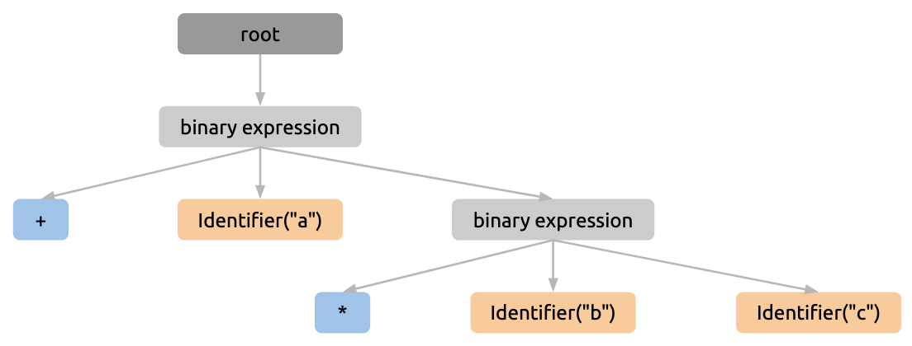

# 1. About

Rust implementation of an interpreter for [*Monkey Programming Language*](https://monkeylang.org/).

The basic idea comes from the book [*"Writing An Interpreter In Go"*](https://interpreterbook.com/).

```
$ cargo run

>> let v = 3.14**float(2);
null

>> v
9.8596

>> v % 3.
0.8596000000000004

>> let factorial = fn(x) { if (x == 0) { return 1; }; x * factorial(x - 1) };
null

>> factorial(3)
6

>> factorial(5)
120

>> let recursive_inverse_fizzbuzz = fn(x) {
    if (x == 0) { return; }
    if (x % 15 == 0) {
        print("FizzBuzz");
    } else {
        if (x % 3 == 0) {
            print("Fizz");
        } else {
            if (x % 5 == 0) {
                print("Buzz");
            } else {
                print(x);
            }
        }
    }
    recursive_inverse_fizzbuzz(x - 1);
};
null

>> recursive_inverse_fizzbuzz(15)
FizzBuzz
14
13
Fizz
11
Buzz
Fizz
8
7
Fizz
Buzz
4
Fizz
2
1
null
```

# 2. Caveats

The language implemented in this repository is very similar to Monkey, but not exactly the same.

Currently, hashmaps is not yet implemented because, well..., I was just not attracted by it, after implementing arrays and function call expressions. They are syntactically different but the implementation details are similar (as far as we borrow the built-in data structures from Go or Rust).

Instead, some new functionalities which are missing in Monkey are implemented. Here's the non-exhaustive list:

- vi-binding is enabled in REPL (with the help of [GNU Readline](https://tiswww.case.edu/php/chet/readline/rltop.html) library).

- Remainder operator (`%`) and power operator (`**`) are implemented.

- Cast functions (e.g. `bool()` and `char()`) are implemented.

- String can be indexed to retrieved the nth Unicode character.

- Arrays can be concatenated by `+`. For example, `[1, 2] + [3]` results in `[1, 2, 3]`.

- etc.

# 3. How It Works

## 3.1 How It Works

1. *Lexer* (`lexer.rs`) splits the input string into *tokens* (`token.rs`).

2. *Parser* (`parser.rs`) parses the generated tokens to build an *AST (abstract syntax tree)* (`ast.rs`).

3. *Evaluator* (`evaluator.rs`) evaluates the AST by *top-down parsing*.

## 3.2 Example

1. Input
    ```
    a + b * c
    ```

2. Tokens
    ```
    [Identifier("a"), Plus, Identifier("b"), Asterisk, Identifier("c"), Eof]
    ```

3. AST
    

4. Result
    ```
    a + (b * c)
    ```

## 3.3 Other Interesting Files

- `object.rs`: Built-in types such as `Int`, `Float`, `Function`, etc. and their base trait `Object`.

- `operator.rs`: Built-in operators. For example, to which types the binary `+` can be applied and its behavior are defined in this file. 

- `environment.rs`: Environment. Scope is represented as a nested environment.

- `builtin.rs`: Built-in constants (e.g. `pi`) and built-in functions (e.g. `print()`, `bool()`, etc.).

<!-- vim: set spell: -->
